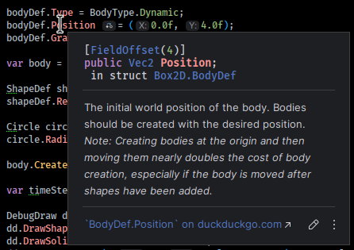
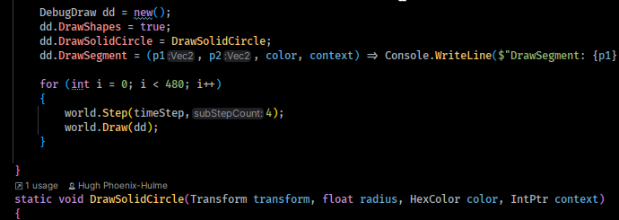
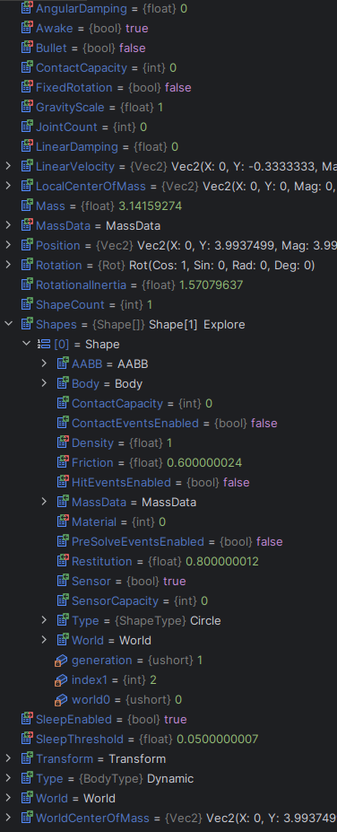

# Box2D-dotnet-bindings
Box2D 3.x Bindings for dotnet (C#, F#, VB, ...)

## What is it?
This is a "link" from dotnet to Box2D 3.x, with an API that should be more familiar and comfortable to dotnet users.

## How is this better than Box2D.NetStandard?
Box2D 3.x contains significant efficiency improvements that make use of SIMD intrinsics.
While it's not impossible to implement in C# - intrinsics have been available since dotnet 6 - it's probably unlikely that Box2D 3.x will be ported into Box2D.NetStandard: one of the challenges with Box2D.NetStandard has always been keeping it up-to-date with changes to Box2D 2.x, and the performance was never on par. Since Box2D 3.x builds to shared libraries, it makes much more sense all round to simply write bindings to that library than to put time into porting it. It also means I can target .net standard 2.1 instead of dotnet 6 or above.

## How is this better than Hexa.NET.Box2D or Box2D.NET?
Hexa.NET.Box2D and Box2D.NET are auto-generated with code generators, and are direct mappings of the Box2D API. This, by contrast, is a hand-crafted API that is designed to be more idiomatic to dotnet coders.
These bindings also have full XmlDoc comments and fully defined delegates.
In this case "better" is probably subjective: Hexa.NET.Box2D and Box2D.NET are more likely to be API-complete with the Box2D version that they target, while this library brings quality of life improvements.

### This library includes:
Full XML documentation

Fully defined delegates

PascalCased properties that populate from the underlying Box2D API

## Getting things working

If you want to just use it, get the NuGet package HughPH.Box2D using your IDE. Package info: https://www.nuget.org/packages/HughPH.Box2D/

If you want to contribute:

1. Clone this repo, then either build it or add a DLL reference, or copy it into your solution and add a project reference, or configure it as a submodule.
  - (If this is too cryptic, you should probably just use the NuGet package - which *should* include the native libraries - if this doesn't work, please raies an Issue)
2. Clone the main branch of Erin Catto's incredible Box2D project from https://github.com/erincatto/box2d
3. Build Box2D shared library:
  - CD into the box2d repo
  - Execute the commands in build.sh or build.bat, but for the first `cmake` command, add `-DBOX2D_SAMPLES=OFF -DBUILD_SHARED_LIBS=ON` before the `..`
  - (If this is too cryptic, this might not be the project for you.)
4. You fill find the shared object or DLL in ./build/src on Linux and .\build\bin\Debug on Windows
5. Make sure that file gets into your output dir
